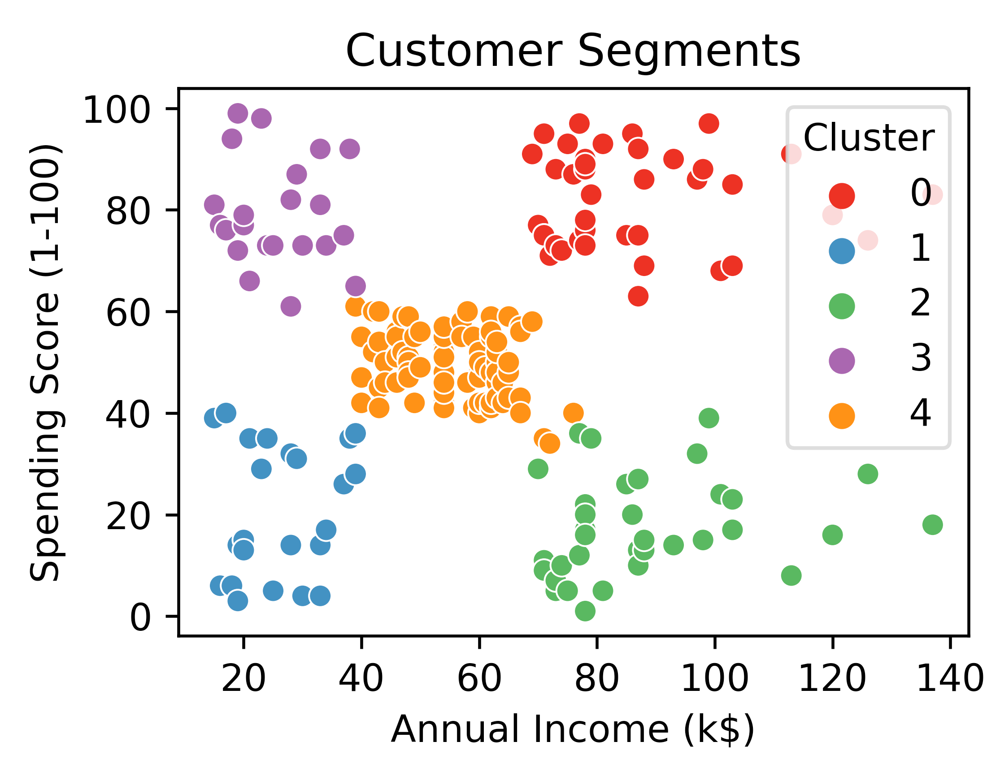

# Customer Segmentation with K-Means Clustering

## Description
This project involves segmenting customers based on their annual income and spending score using K-Means clustering.

## Technologies
- Python
- Pandas
- Scikit-learn
- Matplotlib
- Seaborn

## Setup
1. Clone the repository: `git clone https://github.com/BuseDataInsights/My-Portfolio.git`
2. Navigate to the project directory: `cd My-Portfolio/customer-segmentation`
3. Install dependencies: `pip install -r requirements.txt`

## Usage
1. Run the clustering script: `python cluster_customers.py`
2. View the results in the output folder.

## Examples

## Contact
- **Email:** busekeles@sabanciuniv.edu
- **LinkedIn:** [Buse Keleş LinkedIn Profile](https://www.linkedin.com/in/busekeles)
